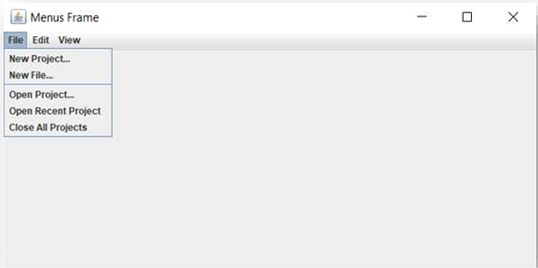

# Java Swing Menus Frame



##  Overview
This project is a **Java Swing application** that demonstrates how to create a menu bar with menus, submenus, and menu items inside a JFrame.  
It serves as a basic example for beginners learning about Swing menus in Java.

---

##  Features
- **File Menu**: New Project, New File, Open Project, Open Recent, Close All Projects  
- **Edit Menu**: Undo, Redo, Cut, Copy, Paste  
- **View Menu**: Includes *Editors* and *Split* submenus with additional options  

---


Open the project in NetBeans or any IDE of your choice.

Run the MenusFrameApp class to launch the application.

##  How to Run
1. Clone the repository:
   ```bash
   git clone https://github.com/LungeloMK/Java-Swing-MenusFrame.git
